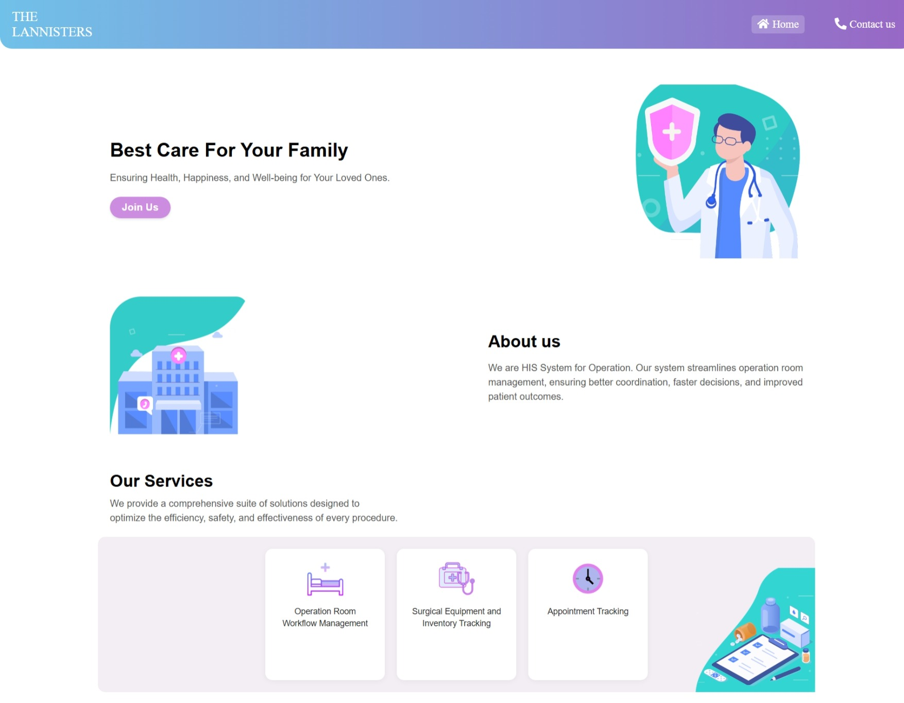
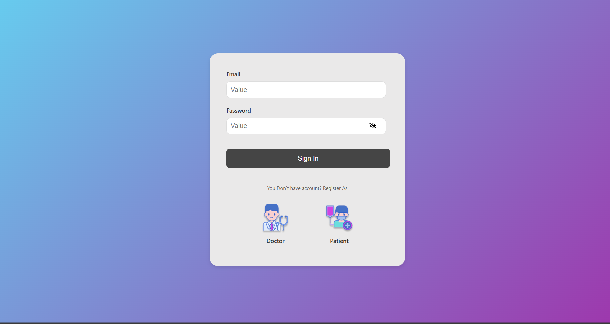
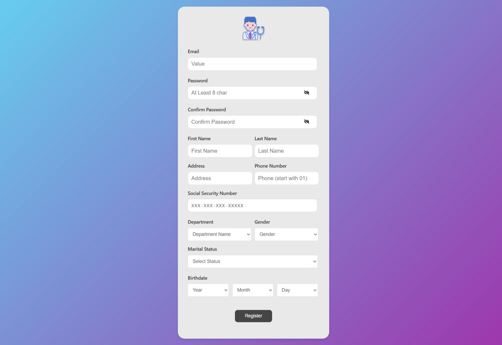
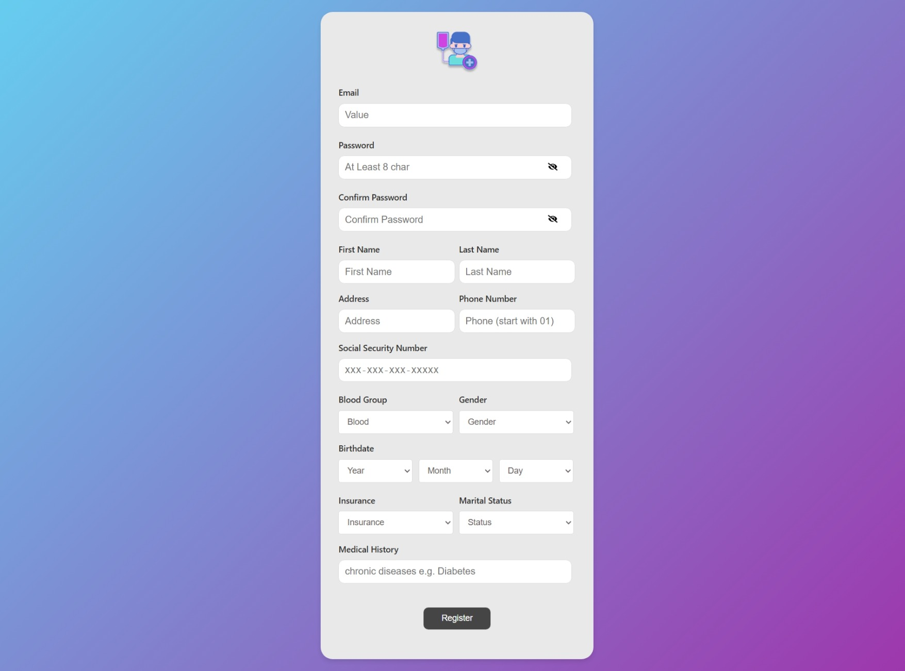
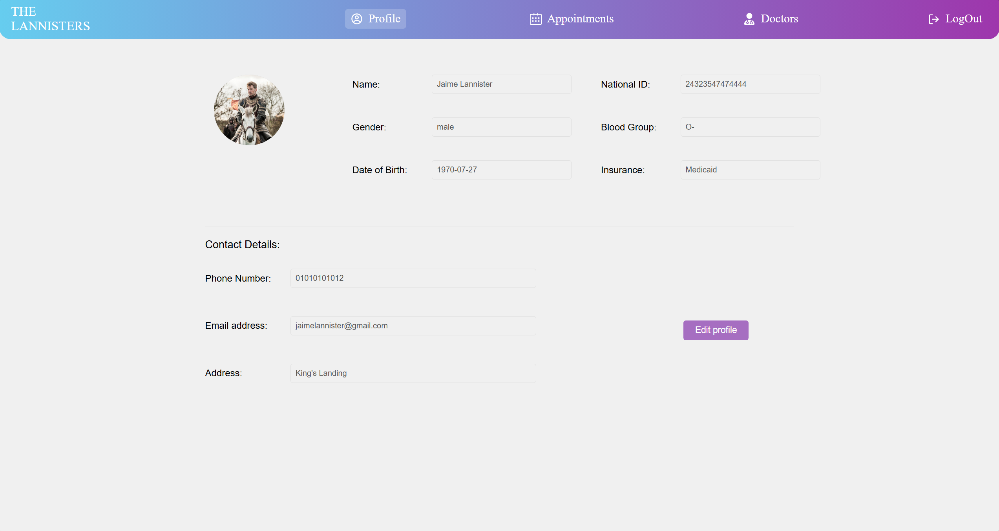
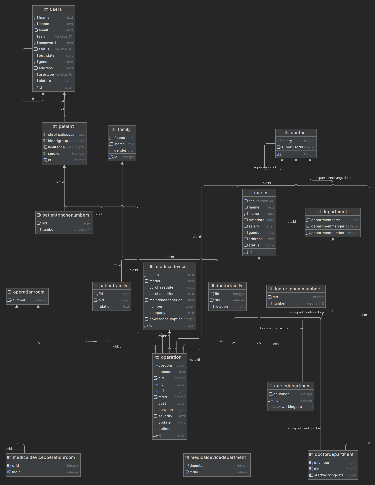

| Name | ID |
| --- | --- |
| Ahmed Ahmed Mokhtar  | 9230119 |
| Ahmed Mohamed Abdelsalam | 9230175 |
| Osama Magdy Ali | 9230206 |
| Amira Yasser Mohamed  | 9230248 |
| Menna Allah khalifa  | 9231071 |


  
video: [Database-Team7-Phase 1-video](https://drive.google.com/drive/folders/1Dor6Wa-wTO7PF5oWMS4aLC8ekvAEdTmE?usp=sharing)
Video:  [Database-Team7-Phase 2-video](https://drive.google.com/drive/folders/1Dor6Wa-wTO7PF5oWMS4aLC8ekvAEdTmE)


## set up 

Step 1: install Node.js from [official website](https://nodejs.org/en/download/)


Step 2: Navigate to your frontend directory and install the required Node modules:

  ```bash
   cd operationRoom/project  # the front dir
   npm install 
  ```

Step 3: Add Useful Packages
  ```bash
   npm install axios --save
   npm install react-router-dom
   npm install react-icons
  ```

Step 4: Run the frontend
  ```bash
   npm run start
  ```

Step 5: Navigate to the root backend directory and run the .NET server:
  ```bash
 cd ./operationRoom/
 dotnet run 
  ```


## Features Implemented

### Database Design

- A normalized relational schema for managing patient records and user authentication.
- Includes entities like:
    - `Patient`
    - `Users`
    - `Operation`
- ER Diagram and SQL schema files

### Pages

We used React.js in front to make:

- **Home Page** – get an overview about the website.




- **Login Page** – Allows registered patients and doctors to securely log in.



- **Doctor Register Page** – Enables new Doctors to sign up with validation and hashing



- **Patient Register Page** – Enables new Patient to sign up with validation and hashing



- **Profile Page** – Displays patient details fetched from the database



- **Admin Dashboard:** Shows the Admin's profile details and the statistics of the patients and doctors in the hospital

- **Admin Function:** By searching for their name, the admin can view, edit, and delete the profiles of doctors and patients.

 Admin Account for testing: email: admin@gmail.com   Password: Hearmeroar0#


### Relational Model




